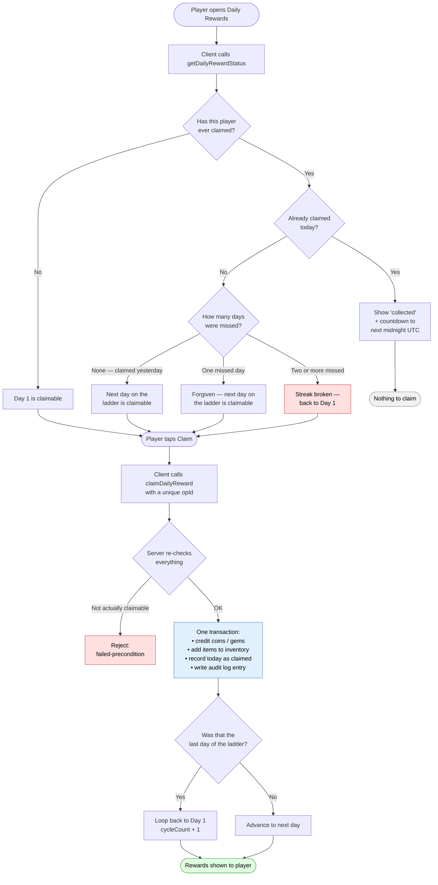

# Daily Rewards — How It Works

Plain-English guide to the daily login reward system. No prior knowledge of the codebase needed.

---

## 1. The idea in one paragraph

Every day a player opens the game, they can collect one free reward. Collect on consecutive days and you climb a 7-day ladder, where each day's prize is better than the last and day 7 is the big one. Miss a day and you're forgiven once. Miss two days in a row and you drop back to day 1. After you collect day 7, the ladder loops back to day 1 and you go again.

Everything is decided by our server. The player's phone has no say in what day it is, what they've earned, or whether they're allowed to claim. That's the whole anti-cheat story, and section 5 explains why it works.

---

## 2. The 7-day ladder

| Day | Reward | SKU | Gems credited | Shop price |
|-----|--------|-----|---------------|------------|
| 1 | 1,000 coins | *currency* | — | — *(soft)* |
| 2 | 2× Speed Up (15m) | `sku_spd15m_j8k2` | — | 16 |
| 3 | 30 gems | *currency* | **30** | 30 |
| 4 | 1× EXP Booster (6h) | `sku_60fdgqkm` | — | 60 |
| 5 | 3,000 coins + 2× Speed Up (1h) | `sku_spd1h_m5t6` | — | 40 *(+soft)* |
| 6 | 1× Coin Booster (6h) | `sku_eqzbetwm` | — | 80 |
| 7 | 1× Rare Crate + 75 gems | `sku_72wnqwtfmx` | **75** | 225 |
| | **Perfect week** | | **105** | **451** |

Two different numbers, and it matters which one you quote:

- **105 gems** is what actually lands in the player's wallet each week (~450/month). This is
  the figure that competes with gem IAP directly, and it's the conservative one.
- **451 gems** is what the week's rewards would *cost to buy* in the shop — the giveaway
  value. It includes the boosters, speed-ups and the crate, none of which are gems.

Plus 4,000 coins, which aren't counted in either figure — coins are soft currency and are
given generously. For comparison, the previous 30-day ladder credited roughly 350 gems per
week in raw gems alone, so this is a normalisation rather than a cut.

**Why the mix looks like this:**

- **Utility over raw gems.** Speed-ups and boosters push players into the V2 timer loops
  (fuel, crate slots, pit crew). They drive engagement and can't be hoarded toward a car
  purchase. Gems are fungible and cannibalise the shop, so only days 3 and 7 carry them.
- **Day 7 is ~50% of the week's value.** A milestone that's merely "slightly bigger" doesn't
  pull anyone through six days.
- **Rare Crate, not Exotic.** Exotic is 400 gems — a ~$3.50 crate, weekly, forever. Rare at
  150 still feels like an event and leaves Exotic/Legendary meaningful as purchases and as
  V2 crate-slot payoffs.
- **Day 5 dips in gem value but spikes visually** (3,000 coins is a big number on screen).
  Variety in *what* arrives beats a monotonic gem curve.

**None of these values are in the code.** They live in a config file that we upload to the database (see section 8). Changing a reward means editing that file and re-uploading — no code change, no deploy.

> ⚠️ **Don't put Shards in here.** The Shard SKUs (`sku_wuqz6rvk0y` and friends) are
> `category: "currency"` with `metadata.currency: "spellShards"`. Granting one as an `item`
> would drop an inert SKU doc into the player's inventory instead of crediting their shard
> balance. That path needs verifying before shards can appear in a reward bundle.

> ℹ️ **Crates need no key attached.** Every crate has a paired `keySkuId` in `CratesCatalog.json`
> and keys are sold for 50–500 gems, but nothing consumes them — `src/crates/openCrate.ts` is
> headed *"Instant Crate Open (No Keys, No Timers)"* and `cratesV2/` never references keys.
> Granting a crate alone is sufficient.

---

## 3. What a player experiences

**Day 1 — first time.** They install the game and open the daily rewards screen. Day 1 is glowing and claimable. They tap it and get 1,000 coins.

**Same day, later.** They come back that evening. The screen shows day 1 as collected and a countdown to midnight. Nothing to claim.

**Day 2.** After midnight UTC, day 2 unlocks. They claim and get the XP booster.

**Day 3 — they're busy and don't play at all.** Nothing happens. No punishment yet.

**Day 4 — they come back.** They missed one day, which is forgiven. Day 3's reward (500 gems) is waiting for them. Their streak is intact.

**Days 5 and 6 — away again, two days in a row.** This is past the forgiveness allowance.

**Day 7 — they return.** The ladder has reset. They're back on day 1 and claim 1,000 coins. Their progress toward the Legendary Crate starts over.

---

## 4. The flow, as a picture



---

## 5. How we stop cheating

This is the part worth understanding properly, because it's what the whole design is built around.

### The trick: days are numbers, not clocks

Instead of storing "they last claimed at 9:47pm on Tuesday" and doing date arithmetic, we convert the current server time into a **single whole number** — how many days have passed since 1 January 1970.

```
day number = (server time in milliseconds) ÷ (24 hours), rounded down
```

Today might be day number `20,489`. Tomorrow is `20,490`. Always. Forever. It only ever goes up.

When a player claims, we save that number. To decide whether they can claim again, we ask one question:

> Is today's number **bigger** than the number we saved?

That's it. That single integer comparison is the entire rule.

### Why each cheat fails

| What a cheater tries | Why it does nothing |
|---|---|
| **Changes the phone clock to tomorrow** | We calculate the day number from *our* server's clock. The phone's clock is never read, never sent, never trusted. |
| **Changes the phone timezone** | Same reason. The boundary is a fixed UTC rollover set once globally, not per-player. A player in Mumbai and a player in London roll over at the same instant. |
| **Sets the clock back to re-claim** | The saved day number can only move forward. If the incoming day number isn't bigger, there is nothing to claim. |
| **Taps Claim 20 times fast** | Every claim carries a unique `opId`. The first one is recorded; the other 19 find that receipt and get handed back the *same* result instead of new rewards. |
| **Claims from two devices at once** | Both attempts run as database transactions on the same record. The database lets exactly one through; the second re-reads, sees today is already claimed, and is rejected. |
| **Edits the game to send "give me day 7"** | The client never tells the server which day it wants. It sends only "claim, here's my opId". The server works out the day itself. |
| **Reinstalls the game / new phone** | Progress lives on our server against their account, not on the device. |
| **Runs a modified/fake client** | App Check is enforced on both functions. Requests that can't prove they come from the real app are rejected. |

### The one thing to get right on the client

The countdown timer ("next reward in 6h 12m") must **not** be computed from the phone's clock. Every response includes `serverNowMs` — the server's current time. Unity should take that value once, then tick it forward locally using `Time.realtimeSinceStartup` (which measures elapsed time, not wall-clock date).

This isn't a security issue — a wrong countdown can't grant anything. It's a correctness issue: a player whose phone clock is 3 hours off would otherwise see a timer that hits zero while the button stays disabled, and file a bug.

---

## 6. Where things are stored

Each player has one small record:

```
/Players/{uid}/DailyRewards/Status
```

| Field | Meaning |
|---|---|
| `streakDay` | Which rung of the ladder they'll claim **next** (1–7) |
| `lastClaimedDayIndex` | The day number of their last claim — the anti-cheat anchor |
| `lastClaimedAt` | Human-readable timestamp (for support and analytics) |
| `totalClaims` | Lifetime number of claims |
| `cycleCount` | How many full 7-day ladders they've completed |
| `configVersion` | Which version of the reward config was live at their last claim |

And one small permanent record per claimed day:

```
/Players/{uid}/DailyRewards/Status/Log/{dayNumber}
```

This stores what they got and when. It serves two purposes:

1. **Player support.** When someone writes in saying "I claimed and got nothing", there's a definitive record.
2. **A second lock.** The log entry is created with "fail if this already exists" semantics inside the same transaction. Even if the main status record were somehow corrupted or hand-edited in the console, a duplicate claim for the same day still can't get through.

---

## 7. The two functions

### `getDailyRewardStatus`

Read-only — it never changes anything, so the client can call it as often as it likes with no risk.

Returns:

```jsonc
{
  "serverNowMs": 1770249600000,   // use this for the countdown, not the phone clock
  "streakDay": 3,                 // which rung is next
  "cycleLength": 7,
  "isClaimable": true,
  "nextClaimAtMs": 1770336000000,
  "msUntilNextClaim": 0,
  "streakExpiresAtMs": 1770508800000,  // claim before this or the streak resets
  "totalClaims": 12,
  "cycleCount": 1,
  "graceDays": 1,
  "configVersion": "v2-daily-rewards-7d",
  "ladder": [
    { "day": 1, "isMilestone": false, "state": "claimed",
      "rewards": [ { "kind": "coins", "quantity": 1000, "skuId": null, "displayName": "Sack of Coins" } ] },
    { "day": 2, "isMilestone": false, "state": "claimed",   "rewards": [ /* … */ ] },
    { "day": 3, "isMilestone": false, "state": "claimable", "rewards": [ /* … */ ] }
    // … through day 7
  ]
}
```

The whole ladder comes back with each day already marked `claimed`, `claimable`, or `locked`, so the UI just paints what it's told. The client should never work out claimability itself.

### `claimDailyReward`

Send: `{ "opId": "<a unique string per claim attempt>" }`

That's the entire input. No day number, no reward ID, no timestamp — the server decides all of it.

Returns which day was claimed, exactly what was granted, coin/gem balances before and after, the next day on the ladder, and the next claim time.

**Errors the Unity client should handle:**

| Code | Meaning | What to show |
|---|---|---|
| `failed-precondition` | Already claimed today | Refresh status; show the countdown |
| `unauthenticated` | Not signed in | Send to login |
| `invalid-argument` | Missing or empty `opId` | Client bug — log it |
| `aborted` | An identical claim is mid-flight | Wait a moment, refresh status |
| `internal` | Something broke server-side | Generic retry message |

---

## 8. Changing the rewards

The config lives at `seeds/Atul-Final-Seeds/DailyRewardsConfig.json`.

```jsonc
{
  "version": "v2-daily-rewards-7d",
  "cycleLength": 7,          // length of the ladder
  "loopCycle": true,         // wrap back to day 1 after the last day
  "resetOffsetMinutes": 0,   // 0 = rollover at midnight UTC; 240 = 04:00 UTC
  "graceDays": 1,            // missed days forgiven before the streak resets
  "slots": {
    "1": {
      "day": 1,
      "isMilestone": false,
      "rewards": [
        { "kind": "coins", "quantity": 1000, "displayName": "Sack of Coins" }
      ]
    }
    // … 2 through 7
  }
}
```

**Reward kinds:**

- `coins` / `gems` — currency. Credited straight to the player's balance. **Must not have a `skuId`.**
- `item` / `crate` — inventory. **Must have a `skuId` that exists in `ItemSkusCatalog.json`.**

A day can hand out any number of rewards — mix currency and items freely.

### Tuning knobs, no code change required

| Want to… | Change |
|---|---|
| Make the ladder 14 or 30 days | `cycleLength`, and add the matching slots |
| Roll over at 4am UTC instead of midnight | `resetOffsetMinutes: 240` |
| Be strict — one miss and you're out | `graceDays: 0` |
| Be generous — forgive two misses | `graceDays: 2` |
| Stop looping; park on the last day | `loopCycle: false` |

### To publish a change

```bash
# 1. Edit the JSON, then check it before uploading.
#    This catches bad SKU IDs, which would otherwise only surface
#    as an error when a real player taps Claim.
npm run tools:validate-daily-rewards

# 2. Upload to sandbox
node tools/seedV2Catalogs.mjs sandbox
```

The server caches config for 5 minutes, so a change takes up to 5 minutes to appear (or immediately after the functions next cold-start).

**Editing rewards never requires a deploy.** Only changes to the *logic* need one.

A mid-cycle config change is safe: players are tracked by day *number*, not by a snapshot of their rewards. Someone sitting on day 5 will simply get whatever day 5 says at the moment they claim.

---

## 9. Files in this feature

| File | What it does |
|---|---|
| `src/dailyRewards/dailyRewards.ts` | The two Cloud Functions |
| `src/dailyRewards/lib/dayIndex.ts` | The day-number maths and the claim rules. Pure — no database, so it can be tested at any point in time |
| `src/shared/rewardLines.ts` | Reward types and config validation |
| `src/shared/rewardBundle.ts` | Turns a list of rewards into actual currency and inventory grants |
| `src/shared/inventoryAwards.ts` | Low-level inventory writes |
| `src/core/configV2.ts` | Loads and validates the config from the database (5-min cache) |
| `seeds/Atul-Final-Seeds/DailyRewardsConfig.json` | The rewards themselves |
| `tools/validateDailyRewardsSeed.ts` | Pre-upload safety check |
| `test/dailyRewards.dayIndex.test.ts` | Tests for the rules — run without a database |
| `test/dailyRewards.test.ts` | End-to-end tests against the Firestore emulator |

---

## 10. Notes for whoever works on this next

**Why there's no scheduled job.** Streak expiry is worked out at the moment a player reads or claims, by comparing two numbers. Running a nightly job over every player to reset streaks would cost a fortune and buy nothing.

**Why reads and writes are strictly separated.** Firestore requires every read in a transaction to happen before every write. The previous version of this code granted items *after* it had already written — which meant the claim failed every single time, for every player, because every day had an item. The current code loads everything up front (`prepareRewardBundle`) and then writes (`applyRewardBundle`). The dev-mode guard in `src/core/tx.ts` will throw loudly if anyone reintroduces a read in the write phase. Keep it that way.

**Why status never writes.** `getDailyRewardStatus` is pure read. If it lazily "fixed up" state on read, then simply opening the screen would mutate the player's record, and a burst of polling would turn into a burst of writes.

**The test clock.** Both functions accept a `__testNowMs` value to simulate any date. It is ignored unless `FUNCTIONS_EMULATOR === "true"`, so it cannot be reached in a deployed function no matter what a client sends. Don't remove that guard.

**Adding a "Streak Shield".** If you want the Duolingo-style purchasable streak protection later, the hook is already there: it's the `graceDays` branch in `resolveClaimState`. Make it consume an inventory SKU instead of reading a fixed config number. That's roughly twenty lines and a seed change — no redesign.
