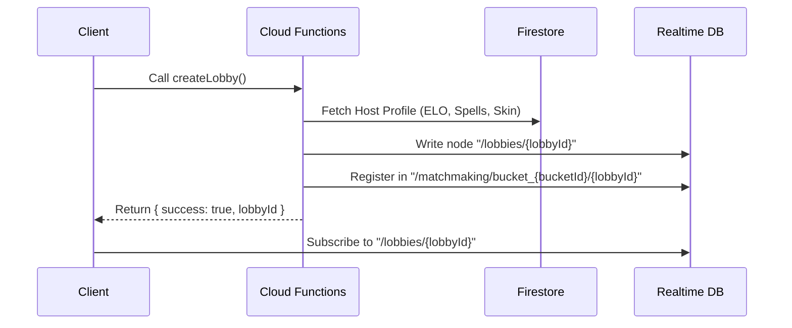

# Multiplayer Lobbies & Spell Mastery Balancing Guide

This guide provides a comprehensive technical overview, API specifications, database architectures, and step-by-step usage instructions for the features introduced in commits **`9f03df1cb6001f45f0c03d2b66d318ea83e931b5`** and **`594d19d95ce52224bebe22cff7e71d26a8b7e593`**.

---

## Table of Contents
1. [Overview](#1-overview)
2. [Multiplayer Matchmaking & Lobby Service](#2-multiplayer-matchmaking--lobby-service)
   * [Core Architecture](#core-architecture)
   * [Realtime Database Schema](#realtime-database-schema)
   * [API Endpoint Contracts](#api-endpoint-contracts)
3. [Spell Balancing & Mastery Unification](#3-spell-balancing--mastery-unification)
   * [The XP Scaling Challenge](#the-xp-scaling-challenge)
   * [The Solution (1-to-1 Unification)](#the-solution-1-to-1-unification)
   * [Configuration Changes](#configuration-changes)
   * [Administrative Migration Script](#administrative-migration-script)
4. [Integration & Usage Guide](#4-integration--usage-guide)
   * [Client-side Unity Integration](#client-side-unity-integration)
   * [Running the Admin Migration](#running-the-admin-migration)

---

## 1. Overview

The backend was upgraded with two major systems:
1. **Multiplayer Lobby & Matchmaking System:** A Firebase Realtime Database (RTDB) backed matchmaking service exposing client APIs for lobby creation, roster management, ELO-based search buckets, host migration, host-authoritative kicks, and Unity Gaming Services (UGS) Relay code synchronization.
2. **Spell XP and Mastery Rebalance:** A complete overhaul of the progression equation. The complex and confusing `0.33` runtime spell mastery dampener was removed (`spellWeight = 1.0`). Spell XP gain rates and level caps in the game design catalogs were pre-scaled by `0.35x`, resulting in an intuitive **1 Spell XP = 1 Mastery XP** progression, while preserving identical leveling pacing.

---

## 2. Multiplayer Matchmaking & Lobby Service

Implemented in `src/race/lobbyService.ts` and exposed as callable Firebase v2 Functions in `src/index.ts`.

### Core Architecture
The multiplayer lobbies operate in a **hybrid model**:
* **Firestore** acts as the persistent system of record for player metadata (ELO, username, car skins, active deck).
* **Realtime Database (RTDB)** acts as the high-throughput, low-latency state-synchronization layer for lobbies, player rosters, and matchmaking buckets.
* **Firebase Cloud Functions** act as the authoritative gatekeeper executing mutations transactionally to ensure state integrity.



---

### Realtime Database Schema

#### 1. Lobbies Node (`/lobbies/${lobbyId}`)
This node holds the active status of each lobby.

```json
{
  "lobbyId": "lobby_abc123xyz",
  "hostUid": "player_host_uid",
  "status": "waiting", // "waiting" | "racing"
  "createdAt": 1747036800000,
  "sharedRandomSeed": "seed_pqrs789", // Ensures synced client random events (e.g. powerup spawns)
  "relayJoinCode": "UGS_RELAY_CODE_HERE", // Host registers this code once allocated
  "members": {
    "player_host_uid": {
      "username": "Speedster_Host",
      "elo": 1250,
      "spells": ["fireball", "icelock", "shield", "boost"],
      "carSkin": "neon_streak",
      "joinedAt": 1747036800000
    },
    "player_guest_uid": {
      "username": "Racer_Two",
      "elo": 1180,
      "spells": ["fireball", "shield"],
      "carSkin": "default",
      "joinedAt": 1747036850000
    }
  },
  "kickedPlayers": {
    "spammer_uid": true // Blocklist to prevent rejoining
  }
}
```

#### 2. Matchmaking Index Node (`/matchmaking/bucket_${rankBucket}/${lobbyId}`)
To optimize lobby search, lobbies are partitioned into ELO rank buckets (each bucket spans 200 ELO points, calculated as `Math.floor(elo / 200)`).

```json
{
  "hostUid": "player_host_uid",
  "rosterSize": 2,
  "createdAt": 1747036800000
}
```

---

### API Endpoint Contracts

All functions are callable HTTPS endpoints enforcing Firebase Auth credentials.

#### 1. `createLobby()`
Creates a fresh multiplayer lobby.
* **Input Parameters:** None (takes caller's auth token)
* **Returns:** `{ success: true, lobbyId: string }`
* **Internal Behavior:**
  1. Retrieves caller's ELO and equipped cosmetics.
  2. Sets up `/lobbies/${lobbyId}`.
  3. Indexes the lobby under the appropriate ELO bucket `/matchmaking/bucket_${rankBucket}/${lobbyId}`.

#### 2. `joinLobby()`
Joins an existing lobby if criteria are met.
* **Input Parameters:**
  ```json
  { "lobbyId": "lobby_abc123xyz" }
  ```
* **Returns:** `{ success: true }`
* **Errors Thrown:**
  * `permission-denied`: Player is in the `kickedPlayers` list.
  * `resource-exhausted`: Lobby is full (limit is 8 players).
  * `not-found`: Lobby does not exist.

#### 3. `leaveLobby()`
Removes the caller from a lobby.
* **Input Parameters:**
  ```json
  { "lobbyId": "lobby_abc123xyz" }
  ```
* **Returns:** `{ success: true }`
* **Internal Behavior:**
  * If the leaving user was the **last member**, the lobby and matchmaking nodes are entirely purged from RTDB.
  * If the leaving user was the **Host**, the backend automatically performs **Host Migration**:
    1. Elects the next remaining roster member as the new host (`hostUid` update).
    2. Moves the matchmaking index node from the old host's ELO rank bucket to the new host's ELO rank bucket.

#### 4. `kickPlayer()`
Host-only action to boot a member out.
* **Input Parameters:**
  ```json
  {
    "lobbyId": "lobby_abc123xyz",
    "playerUidToKick": "offender_uid"
  }
  ```
* **Returns:** `{ success: true }`
* **Errors Thrown:**
  * `permission-denied`: The caller is not the current host of this lobby.

#### 5. `submitRelayJoinCode()`
Host-only action to broadcast the Unity Gaming Services (UGS) Relay Join Code to the rest of the lobby.
* **Input Parameters:**
  ```json
  {
    "lobbyId": "lobby_abc123xyz",
    "relayJoinCode": "4G7K9"
  }
  ```
* **Returns:** `{ success: true }`
* **Errors Thrown:**
  * `permission-denied`: The caller is not the current host.

---

## 3. Spell Balancing & Mastery Unification

Implemented in configuration seed catalogs and applied retroactively with `tools/rescaleSpellXp.mjs`.

### The XP Scaling Challenge
Previously, players earned high amounts of Spell XP per race (e.g., 100 base, 250 for a win). However, to prevent spells from over-contributing to overall Player Mastery (a target split of 65% Car Mastery / 35% Spell Mastery), a dampening coefficient of `0.33` was applied to Spell XP *before* converting it to player Mastery. 

This resulted in major UX challenges:
* A player earning `100 Spell XP` would see their Mastery XP bar increase by only `33`.
* Level progression thresholds in the UI were confusing because 1 XP gained was not equal to 1 progress point.

---

### The Solution (1-to-1 Unification)
To achieve clean 1-to-1 arithmetic, the formulas were mathematically pre-scaled:
1. The mastery multiplier `spellWeight` was modified from `0.33` to `1.0` in [MasteryConfig.json](file:///d:/mystic%20motors/mystic-motors-backend/seeds/Atul-Final-Seeds/MasteryConfig.json).
2. All Spell XP earn values and progression caps in [SpellEvolutionV2Catalog.json](file:///d:/mystic%20motors/mystic-motors-backend/seeds/Atul-Final-Seeds/SpellEvolutionV2Catalog.json) were multiplied by **`0.35`** (yielding pre-scaled metrics).
3. **Net Result:** $1\text{ Spell XP earned} = 1\text{ Mastery XP}$. The progression pacing remains perfectly untouched, and the game UI can display raw integers without applying hidden fractional math!

---

### Configuration Changes

#### 1. `MasteryConfig.json`
* **Version:** `v4-spell-weight-unity`
* **`spellWeight`:** `1.0` (previously `0.33`)

#### 2. `SpellEvolutionV2Catalog.json`
* **Version:** `v6-spell-xp-rescale`
* **Spell XP Config Scaling:**

| Metric | Old Value | New Value (0.35x Scale) |
| :--- | :--- | :--- |
| **`xpPerRace`** | 100 | **35** |
| **`xpPerWin`** | 250 | **88** |
| **`xpPerSpellCast`** | 50 | **18** |
| **Level 1 Cap** | 4,000 | **1,400** |
| **Level 2 Cap** | 12,000 | **4,200** |
| **Level 3 Cap** | 20,000 | **7,000** |
| **Level 4 Cap** | 27,000 | **9,450** |

#### 3. Tuning Metric Updates (`CarTuningConfig.json`)
* Bumps the global speed limit ceiling from `350` to `450` in the tuning parameter ranges.

---

### Administrative Migration Script

A production-grade migration script **`tools/rescaleSpellXp.mjs`** was added to process and align all registered players on Firestore to the new 0.35x scale and unified weight formula.

**What the script does:**
1. Recalculates total Car XP earned from the player's garage.
2. Scales down all internal Spell XP progress values by `0.35` inside `Players/${uid}/Spells/Levels`.
3. Recalculates exact `masteryXp` with the new pre-scaled spell values using a `1.0` weight, resolving any delta.
4. Correctly computes their updated `masteryRank`, `level`, `expProgress`, and `expToNextLevel` inside `Players/${uid}/Profile/Profile`.
5. Flags the document with `spellXpRescaled: true` to prevent repetitive processing.

---

## 4. Integration & Usage Guide

### Client-side Unity Integration

#### Listening to Lobby State
Clients should establish an active listener to their specific lobby node on Realtime Database. The host updates state via Cloud Functions, and players dynamically sync.

```csharp
using Firebase.Database;

DatabaseReference lobbyRef = FirebaseDatabase.DefaultInstance.GetReference($"lobbies/{currentLobbyId}");

lobbyRef.ValueChanged += (object sender, ValueChangedEventArgs args) => {
    if (args.DatabaseError != null) {
        Debug.LogError(args.DatabaseError.Message);
        return;
    }

    if (args.Snapshot.Exists) {
        var lobbyData = args.Snapshot.Value as Dictionary<string, object>;
        string status = lobbyData["status"]?.ToString();
        string relayCode = lobbyData.ContainsKey("relayJoinCode") ? lobbyData["relayJoinCode"]?.ToString() : null;

        // 1. Check if guest is kicked
        if (lobbyData.ContainsKey("kickedPlayers")) {
            var kicked = lobbyData["kickedPlayers"] as Dictionary<string, object>;
            if (kicked.ContainsKey(myUid)) {
                HandleKickedFromLobby();
                return;
            }
        }

        // 2. Parse members roster
        var members = lobbyData["members"] as Dictionary<string, object>;
        UpdateLobbyUI(members);

        // 3. Auto-join Relay Session if host registered a code
        if (!string.IsNullOrEmpty(relayCode)) {
            ConnectToUnityRelay(relayCode);
        }
    }
};
```

---

### Running the Admin Migration

To run the migration tool, ensure you are in the backend workspace directory and have your production credentials file `backend-production-mystic-motors-prod.json` present in the parent path.

#### Option 1: Preview Changes (Dry Run)
Prints the prospective modifications for all players without making any changes to the database:
```bash
node tools/rescaleSpellXp.mjs --dry-run
```

#### Option 2: Target a Single Player
Highly recommended to test the math on a sandbox account:
```bash
node tools/rescaleSpellXp.mjs --single-player <user-uid>
```

#### Option 3: Execute Production Migration
Executes batched transactional writes (size = 500) to update all user documents:
```bash
node tools/rescaleSpellXp.mjs
```
